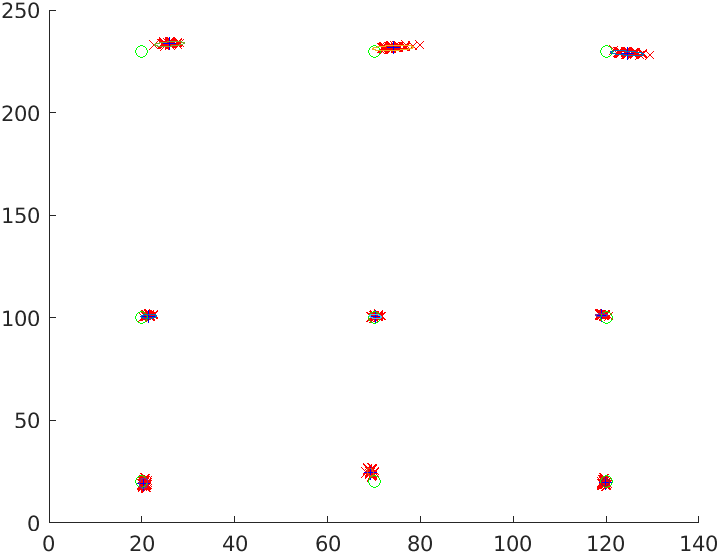
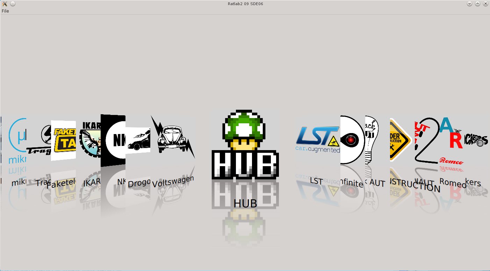
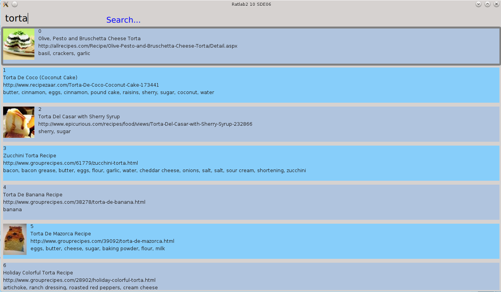

# works for the Applied Computer Systems Laboratory 2 course

### Task 04  
Positioning with Matlab  
  

### Task 07  
C++ in embedded environment  

### Task 08  
Qt and serial communication  

### Task 09  
Cover Flow with QML  
  

### Task 10
Fetch and display food recipes  
  
